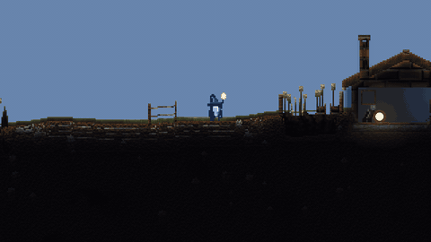
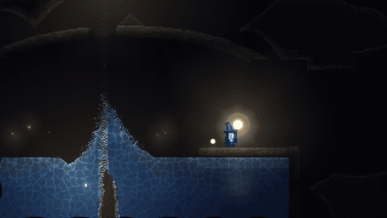
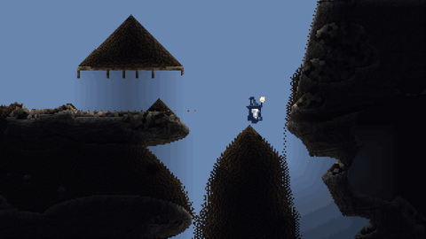
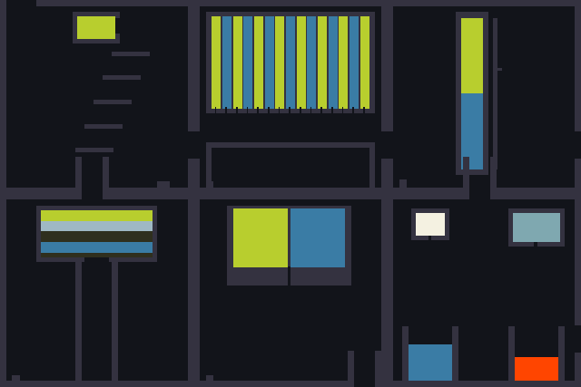
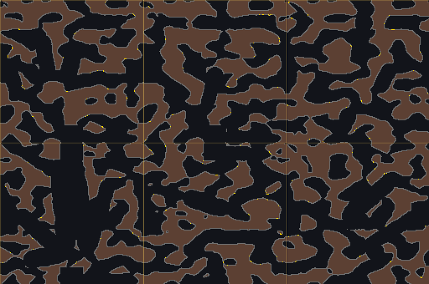

# The Game

A Noita-like game written in Odin from scratch.



One run of the game, played by a script and filmed by the window
([sharper video](docs/images/reel.mp4), [the script](docs/reel.txt)):
he starts on the village green, crosses the rooftops, walks into the
mouth of the coal pit, digs down through the dark leaving a trail of
light, and comes out at the pond where the fireflies live.

## Vision

Classical virtue and discovered narrative. Physics, chemistry, alchemy,
adventure, beauty, sacrifice, tinkering, exploration, defeat, victory.

Priorities, in order: simplicity, ease of change, end-to-end
performance, testability.

## Rules

- **Everything is a material** — a row in `data/materials.txt` — light
  and explosions included.
- Code uses the ponytail complexity ladder.
- Prose uses Simplified Technical English.
- Prefer fat structs and data-oriented design, written for CPU and
  cache behaviour.

`AGENTS.md` is the short form of all of this.

## Build and run

Run every command from the repository root: the data paths are
relative to it.

```sh
odin run src        # play
odin test src       # the tests
make                # bin/the-game, bin/game-mcp, bin/shot
```

If `odin` is not on the PATH, `sudo tools/install-toolchain.sh`
downloads the Odin release archive, which holds the compiler and the
raylib library it links. It takes about half a minute.
`docs/toolchain.md` says what it does.

The game is built and tested against the Odin nightly of 2026-08-20,
not a monthly release: it uses `asm` templates, which landed after
`dev-2026-08` was cut, and the current `core:os`, where a file
operation returns an `Error` rather than a `bool`.
`docs/toolchain.md`, "Why a nightly", says what that costs and when it
ends.

### Look at the world

`bin/shot` draws a rectangle of the world into a PNG with no window
and no display. It is how to see what an edit did. It paints every
cell in the flat colour of its material: the material shaders run on
the GPU, so only the window draws a cell of gold as metal or a cell of
rock as stone. That is the right picture for terrain, which is judged
by shape, and for the alchemy rooms, which are read by colour.

```sh
make shot
./bin/shot biome=Coalmine grid=1 out=shots/coalmine.png
./bin/shot walk=-600 out=shots/dark.png    # lit by the orb, and by what he left
```

For the shaders — the water among them — the game takes a shot of its
own window instead, which needs a display:

```sh
make game
./bin/the-game shot=shots/water.png frames=140 walk=-40
```

The pictures in this README were drawn by these two commands and are
kept in `docs/images/`. Shots themselves are not kept: `shots/` is
scratch.

## Playing

The window opens on the wizard, standing on the village green of the
homelands: six regions of field and cottage along the surface, with
the mouth of the coal pit east of the last of them. Down in the coal
there is a pond with fireflies over it, and it is the one place in the
dark that is already lit.

| Key | Action |
| --- | --- |
| `A` `D` or left and right | Walk |
| `SHIFT` | Run |
| `SPACE`, `W` or `UP` | Jump; hold it in the air to fly |
| Mouse | Point the plasma digger |
| `E` or left mouse | Dig: cut a beam out of his chest, where the cursor points |
| `Q` or right mouse | Throw a pot of black powder, along the cursor |
| Mouse wheel, `-`, `=` | Zoom out and in |
| `TAB` | Open and close the world editor |

**Moving.** Tap the jump key and he jumps. A tap that comes a little
early, while he is still falling, is held for a tenth of a second and
spent the moment his feet land; a tap that comes a little late, just
after he runs off a ledge, still works for a tenth of a second. Hold
the key and the jetpack lights, which empties the tank in two seconds
and fills it again in under one while he stands.

**Digging.** The digger is a beam along the cursor, drawn off the orb
on his staff. It cuts a kerf he can walk down, it stops at what it
cannot cut, and it throws part of what it removes back out of the hole
as debris that then falls. `docs/player.md` says how he is built and
what this phase leaves out.

**The pot.** He carries a little clay pot of black powder. Thrown, it
flies on an arc and breaks on the first thing it touches: a small
explosion that scatters matter by weight and gives off a bang of light
as bright as his own orb while it lasts. `docs/pot.md` says how it
flies, how it breaks, and what this phase leaves out.



**The drudge.** A drudge patrols a stretch of the world, back and
forth, and never gives up the walk to chase. Seen, he turns to face
the wizard and lobs a pot of his own every four seconds, gentler and
slower than the wizard's throw; unseen for half a second, he forgets
and returns to patrol. Neither one can be hurt yet: this phase is only
about being seen or staying hidden. He was a miner once and reads as
one — stooped, coal-dark, lit by the one lamp he carries.
`docs/drudge.md` says how he is built, the numbers he moves by, and
what this phase leaves out.

**The dark.** The orb on the wizard's staff is nearly the only light
in the world. Where the light of the way behind him has run out, a
tiny crystal falls from the orb and hangs where it fell — a small gem
whose gentle glow soaks half a screen of ground — so the way he came
stays marked by a scatter of far-apart lights and everything he has
not been is gloom. `docs/lighting.md` says how that is built and what
it costs.



**The pond.** Down in the caves there is water, drawn by a
shader: a rippling surface, depths that go dark and cold, and a net of
caustics sliding over the bottom. A swarm of fireflies hangs over its
mouth and is the only light on it until he walks up with the orb.
`docs/water.md` says how the pond is dug, where the shader came from,
and how to take a picture of a window to judge it.

**The chemistry.** 48 rows of `data/materials.txt` are the whole of
it: salt goes into water and heat brings it back, nitre and brimstone
and coal make black powder in two steps, quicksilver takes gold up and
fire gives it back, and a spell turns plain rock into a stone that
answers water with light. `docs/alchemy.md` is the note, and the
alchemy gallery is fourteen rooms of it running.



Light and explosions are rows in that file too. An explosion is
`Blast`: strong luminosity and an expulsive force, sitting in the
crater it opens and decaying very quickly into fire. The orb, the
crystals and the fireflies each carry a luminosity of their own and no
physical interaction at all, so nothing in the sandbox can touch one
and one can touch nothing. `docs/lighting.md`, "Every light is a
material", is the list and the rules it keeps.

## How a world is made

Three parts. The **biome map** says which biome owns which region. A
**tile set** says what a biome is made of. The **sandbox** says what a
rectangle of that world does next: sand falls, oil burns, smoke
climbs.

The player walks on all three. Where the play sandbox covers him the
world moves under him — dig a hole and he falls in it — and everywhere
else he still walks on the picture the generator paints. `Terrain` is
the join. `docs/player.md` and `docs/physics.md` ("The wizard meets
the sandbox") say how it works and what it leaves out: a region
regenerates from the map, not from what he changed in it, once he
leaves and comes back.

The authored data:

| Path | What it holds |
| --- | --- |
| `data/materials.txt` | The materials, the lights among them |
| `data/shaders/materials/` | One shader a material, and the prelude they share |
| `data/biomes.txt` | The biomes: a key color, one fill material, and either a flat fill or a set of tiles |
| `data/biome_map.png` | The world layout, one pixel a 512x512-cell region. The game writes a starter map if it is absent |
| `data/tiles/` | The tile sets, one PNG a tile |
| `data/rooms/` | The painted regions: the two galleries, and the twelve homelands and the cavemouth |
| `data/sprites/wizard.png` | The player, one row an animation |
| `data/sprites/drudge.png` | The drudge, the same way, with fewer rows: he only walks, stands, and throws |

### Wang tiles

A biome with `generator = wang` owns a set of 512x512 tiles. The world
is cut into a lattice of tile squares, and each square draws one tile
of the set that owns it. One cell of a tile is one world cell, so what
the author paints is what the wizard walks through. Borders between
biomes stay hard cuts; inside one biome the lattice runs on unbroken,
across region borders as well.



Which tile lands where is a Wang tiling. Every tile carries a color on
each of its four sides. The lattice colors each of its edges from a
hash of that edge's position, and a square takes the tile whose four
sides match the four edges around it. Two squares beside each other
read one edge, so the tiles that land on them always agree about it,
and no rectangle of world has to be generated before another one: the
world stays unbounded and still generates in any order.

Two edge colors make a complete set of 16 tiles. `variants` draws
several pictures of one set of edges, and the lattice picks between
them with a second hash, so the same four edges do not always give the
same tile. The Coalmine set ships with two.

Matching colors is only half of a seam. The cells within 4 of a side
belong to the edge color rather than to the tile: every tile that
carries color 1 on its west side holds the same 4 columns there. The
seeder crossfades a tile's own noise into those columns, so the join
is smooth well beyond them and the lattice leaves no line. A corner
cell sits in two bands at once, so the whole set shares it, which is
why the bands stay narrow. The tile editor keeps all of that true as
you paint, and the save gate refuses a set where it is not.

A tile file is named after what it carries:

```
data/tiles/coalmine_0110_1.png
                    NESW variant
```

A whole set is 32 pictures, which is not hand work, so
`tools/seed_tiles.py` draws one: caves cut from noise, about half of
every tile open. It reads the material and biome tables, so a new
biome only needs `generator = wang` and a `tiles` prefix to be seeded,
and `--check` holds the files on disk to the seam rule.

### Painted regions

A biome with `generator = image` is painted rather than generated: it
names a prefix, and `<prefix>_<variant>.png` is a whole region, one
pixel a world cell, in the material colors. `variants` says how many
drawings the biome owns, and the world picks one per region off the
same hash the tile lattice uses — so a biome one region long is one
hand made room, and a biome six regions long is six drawings out of its
set.

That is what the **homelands** are: the surface the wizard starts on,
six regions of field and cottage drawn from twelve pictures, with a
seventh east of them where the ground climbs into a bluff and a mouth
in its face drops into the coal. `[Map]` says where he starts —
`spawn_biome = Homelands`, `spawn_region = 4` — so the walk east to the
only way down is the longer half of the village.
`tools/seed_homelands.py` draws the thirteen pictures and `--check`
holds them to the two rules that matter: every picture's side edges
agree, so two regions meet with no step, and the middle of every
picture stays open, because that is where the wizard lands.
`docs/homelands.md` is the note.

The two galleries are painted regions too, of one picture each; see
`docs/physics.md` and `docs/alchemy.md`.

## The editors

`TAB` opens the world editor, which takes the camera back so the same
keys pan it:

| Key | Action |
| --- | --- |
| `WASD` or arrows | Pan the camera |
| Left mouse | Paint the selected biome |
| Right mouse | Erase a map pixel |
| `1` to `9` | Select a biome |
| `M` or middle mouse | Look at the region under the cursor |
| `T` | Open the tile set of the selected biome |
| `S` | Save the map image |

The world regenerates as you paint. Save is blocked while the painted
map falls into more than one connected region, and the editor outlines
the stranded pixels in red.

`T` opens the tile editor:

| Key | Action |
| --- | --- |
| Left mouse | Paint the selected material |
| Right mouse | Erase to air |
| `[` and `]` | Walk the set |
| `V` | Next variant of this tile |
| `1` to `9` | Select a material |
| `M` | Look at a region of this biome |
| `N` | Make the seams agree again |
| `S` | Save every tile of the set |
| `T` or `TAB` | Close |

The tile in hand is drawn with the neighbour strips that would sit
beyond each side, so a seam is always painted as a joined picture. The
four edge colors are drawn on the sides they belong to, and the whole
set is on screen beside it.

## Play and author through MCP

The game also runs as an MCP server, so a model can author the world
and play it: paint the biome map, paint a tile, open a sandbox on the
region those edits describe, and run the sand over it.

```sh
make mcp
claude mcp add the-game -- ./bin/game-mcp
```

Every editor tool calls the same procedure the mouse calls, so a model
and a hand cannot paint different worlds. Saving the biome map meets
the same connectivity gate either way.

Commands reach the sandbox through an input queue taken from old
lockstep network code. A command carries an execution tick, not a
time, so the speed of the client does not change the world that comes
out. The same seed, region, and commands always give the same
checksum.

`docs/mcp.md` says what the tools are and where the limits are.

## Layout

```
src/       the game, package game, with the tests beside the code
cmd/mcp/   the MCP server binary
cmd/shot/  the world as a PNG
cmd/bench/ what a tick of the sandbox costs
data/      the materials, the biomes, the biome map, the tiles, the sprites, the shaders
docs/      the design notes and the toolchain
tools/     the toolchain install, the tile and homelands seeders, and the wizard, drudge and gallery seeders
```

| File | What it holds |
| --- | --- |
| `src/worldgen.odin` | The generator: what a world cell is made of |
| `src/biome*.odin` | The biome table and the biome map |
| `src/tile*.odin` | The tiles and their PNG files |
| `src/wang.odin` | The tile lattice, the edge colors, the seam rule |
| `src/reel.odin` | The scripted runs the README's video is filmed from |
| `src/homelands.odin` | The shape the world expects the village to have |
| `src/editor.odin` | The world editor, model and window |
| `src/tile_editor.odin` | The tile editor, model and window |
| `src/player.odin` | The wizard: his body, his step, and where he starts |
| `src/sprite.odin` | The sprite sheet, and which frame of it to draw |
| `src/sandbox.odin` | The cell grid, and the commands that write it |
| `src/cell.odin` | What the step compares: the weight and the kind of a material |
| `src/sandbox_step.odin` | One tick, as four passes over a row |
| `src/sandbox_step_simd.odin` | The pass that costs the tick, in vectors |
| `src/input_queue.odin` | The input queue |
| `src/sim.odin` | The whole game state, with no window in it |
| `src/mcp*.odin` | The MCP server |
| `src/main.odin` | The game window |
| `src/shot.odin` | The world as a PNG, with no window |
| `src/light.odin` | The orb, the crystals, and the gloom around them |
| `src/firefly.odin` | The swarm that hangs over a pond and lights it |
| `src/pot.odin` | The pot of black powder: the throw, the flight, and the break |
| `src/drudge.odin` | The drudge: a patrol who lobs a pot when he sees him |
| `src/drudge_sprite.odin` | The drudge's own sheet, and which frame of it to draw |
| `src/bang.odin` | The explosion as a light: what the world remembers of one |
| `src/alchemy_test.odin` | The second alchemy, measured in the sandbox it runs in |
| `src/pond.odin` | The tests that hold the Grotto tile to being a pond |
| `src/water.odin` | The depth map of the water, and the shader over it |
